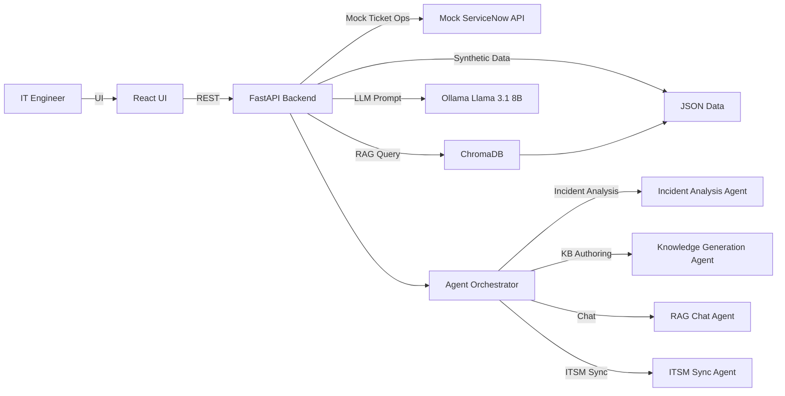

# SitePulse — Agentic IT Ops Platform (Local-First)

## Phase 1: Architecture & Design

### 1) Solution Architecture Diagram



### 2) Component Overview

- **React Frontend**: Dashboard, knowledge base browser, chatbot, ITSM panel.
- **FastAPI Backend**: REST APIs, agent orchestration, data aggregation.
- **Mock ServiceNow API**: Simulates incidents, service requests, updates.
- **Agent Suite**: Analysis, KB generation, RAG chat, ITSM sync.
- **RAG Store (ChromaDB)**: Vectorized KB and incident context.
- **Local LLM (Ollama)**: Optional local inference via `llama3.1:8b`.
- **Synthetic Data**: JSON datasets for incidents, service requests, and Linux KB.

### 3) Tech Stack Justification

- **FastAPI**: Fast, type-safe Python API framework that runs locally.
- **React + Vite**: Lightweight UI stack for a modern dashboard experience.
- **ChromaDB**: Open-source vector DB for local-first RAG.
- **Ollama**: Local inference with open-source LLMs.
- **JSON + Python scripts**: Simple synthetic data generation without external services.

### 4) Data Flow

1. Mock incidents and service requests load from `backend/data/*.json`.
2. Backend exposes metrics, ticket lists, and agent endpoints.
3. Incident resolutions trigger KB generation and vector DB upserts.
4. Chat requests run retrieval in ChromaDB, then prompt the LLM.
5. ITSM sync agent updates mock ticket status.

### 5) Agent Workflow

1. **Incident Analysis Agent** classifies severity and suggests a fix.
2. **Knowledge Generation Agent** turns resolutions into KB articles.
3. **RAG Chat Agent** retrieves KB context and answers questions.
4. **ITSM Sync Agent** updates tickets and closes incidents.

### 6) Folder Structure

```
backend/
  app/
    agents/
    llm/
    rag/
    services/
    main.py
  data/
  scripts/
  requirements.txt
frontend/
  src/
    components/
    styles/
  package.json
  vite.config.js
README.md
```

---

## Implementation

### Backend API

| Endpoint | Method | Description |
| --- | --- | --- |
| `/incidents` | GET | List mock incidents |
| `/incidents/{id}` | POST | Update incident status |
| `/generate-kb` | POST | Generate KB article and store in ChromaDB |
| `/chat` | POST | RAG chatbot query |
| `/dashboard-metrics` | GET | KPI metrics for dashboard |
| `/sync-servicenow` | POST | Resolve incident (mock ServiceNow) |
| `/analyze-incident/{id}` | POST | Incident analysis agent |

### Run Instructions (Local)

1. **Backend**
   ```bash
   cd backend
   python -m venv .venv
   source .venv/bin/activate
   pip install -r requirements.txt
   uvicorn app.main:app --reload --host 0.0.0.0 --port 8000
   ```

   **Note:** If you see a NumPy 2.0 compatibility error from ChromaDB, ensure
   NumPy 1.x is installed (`pip install numpy==1.26.4`) and restart the backend.

2. **Frontend**
   ```bash
   cd frontend
   npm install
   npm run dev
   ```

3. **Optional: Enable Ollama**
   ```bash
   export SITEPULSE_USE_OLLAMA=true
   export OLLAMA_MODEL=llama3.1:8b
   ollama serve
   ```

4. **Generate Synthetic Data**
   ```bash
   python backend/scripts/generate_synthetic_data.py
   ```

---

## Notes

- The platform runs fully offline with mocked data.
- Ollama integration is optional; fallback responses are provided when disabled.
